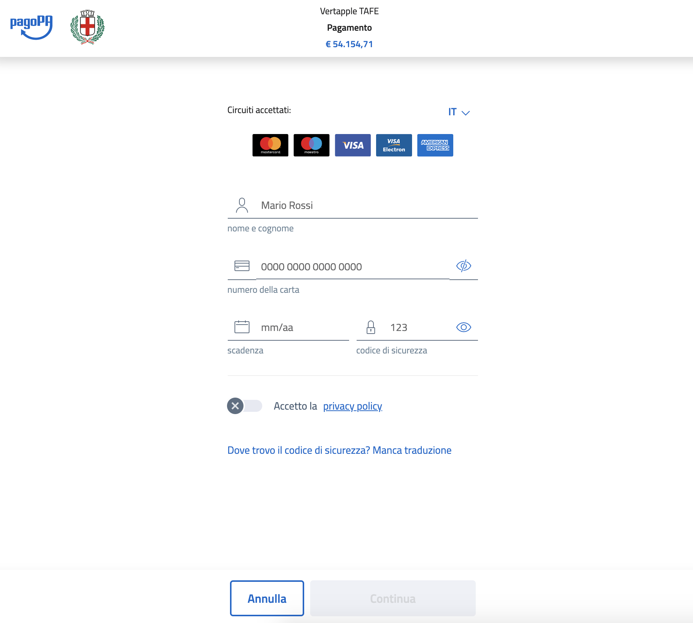

# io-pay
- [io-pay](#io-pay)
  - [Prerequisites](#prerequisites)
  - [Usage](#usage)
  
Is a [WISP](https://docs.italia.it/italia/pagopa/pagopa-specifichepagamenti-docs/it/stabile/_docs/SANP_2.2_Sez2_Cap06_ComponentiTecnicheNodo.html#componente-wisp) replacement project and it will be the first web interface to allow guest (_citizen_) payment of [pagoPa](https://www.pagopa.gov.it/) system.

From now wont be true _"pagoPA non è un sito dove pagare"_ it'll be too 🚀

## Prerequisites

## Usage

From one console typing :
```sh
yarn install
yarn start
```

then open browser [here](http://localhost:1234/index.html?p=12345)

it's all rights you will see something like that 👍


