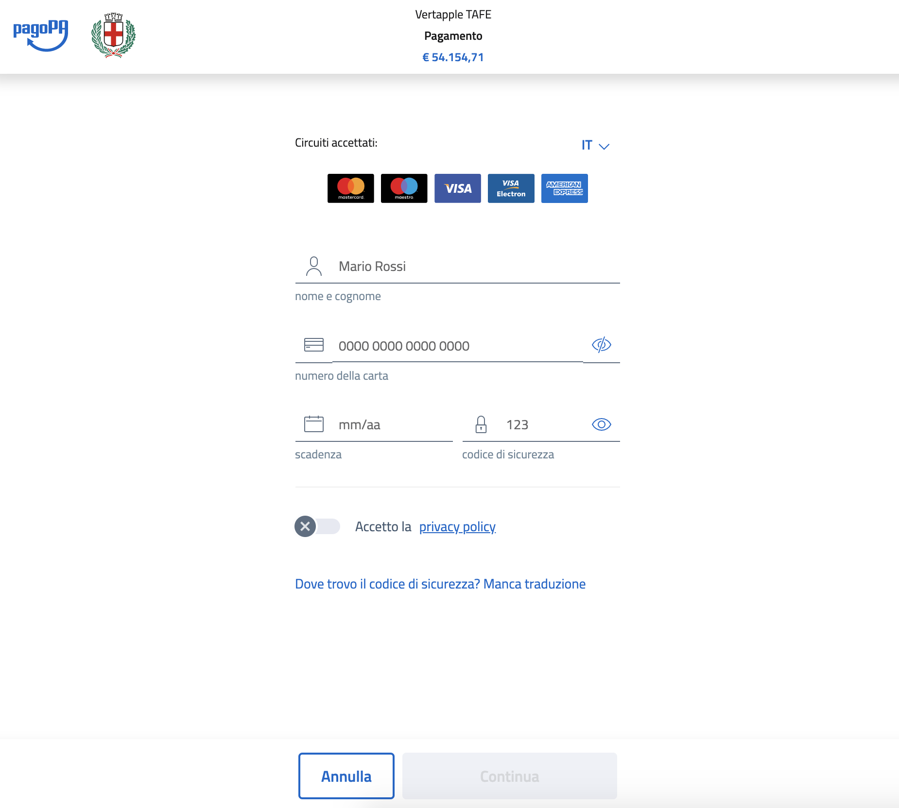
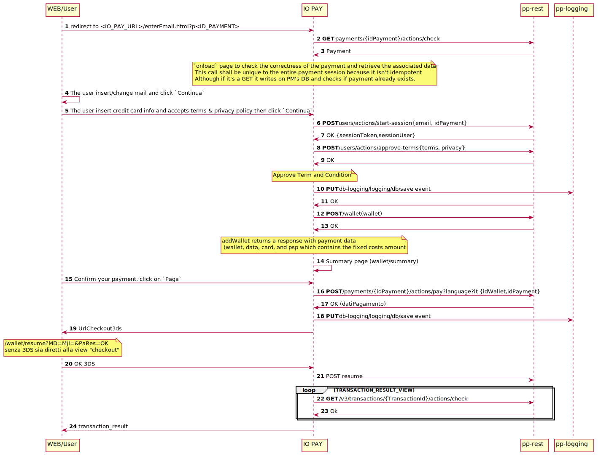

# io-pay
- [io-pay](#io-pay)
  - [Prerequisites](#prerequisites)
  - [Documentation](#documentation)
  - [Running](#running)
  - [Sequence diagram : _WISP light_](#sequence-diagram--wisp-light)
  
Is a [WISP](https://docs.italia.it/italia/pagopa/pagopa-specifichepagamenti-docs/it/stabile/_docs/SANP_2.2_Sez2_Cap06_ComponentiTecnicheNodo.html#componente-wisp) replacement project and it will be the first web interface to allow guest (_citizen_) payment of [pagoPa](https://www.pagopa.gov.it/) system.

## Prerequisites

- [yarn](https://classic.yarnpkg.com/en/docs/getting-started)

## Documentation
All documentary resources can be found here 🚀
- [WISP light](https://drive.google.com/drive/u/0/folders/19LzYVs__dwzCYPtUli_7FpP4wbBQMIVh)
- [io-pay UX MVP](https://pagopa.invisionapp.com/console/share/4A1RGFXIQM)

## Running

Run the following commands in your console :
```sh
yarn install
yarn start
```

then open browser [here](http://localhost:1234/index.html?p=12345)

You should now see something like the following 👍



<!-- 

plantuml -tsvg README.md 

-->

## Sequence diagram : _WISP light_

[Here](https://io-p-cdnendpoint-iopay.azureedge.net/index.html?p=12112) the public endpoint to `io-pay` (alias _Wisp Light_)

<!-- 
@startuml doc/uml_diag/seqdiag-wisplight

autonumber 
participant web as "WEB/User"
participant wl as "IO PAY"
participant api as "pp-rest"
participant logging as "pp-logging"


autonumber 
participant web as "WEB/User"
participant wl as "WISP"
participant api as "pp-rest"
participant logging as "pp-logging"

web -> wl : redirect to <IO_PAY_URL>/enterEmail.html?p<ID_PAYMENT>

wl -> api : **GET** payments/{idPayment}/actions/check
api -> wl : Payment
note over wl: `onload` page to check the correctness of the payment and retrieve the associated data \n This call shall be unique to the entire payment session because it isn't idempotent \n Although if it's a GET it writes on PM's DB and checks if payment already exists.

web -> web :The user insert/change mail and click `Continua`

web -> wl :The user insert credit card info and accepts terms & privacy policy then click `Continua`

wl -> api : **POST** users/actions/start-session{email, idPayment}
api -> wl : OK {sessionToken,sessionUser}

wl -> api : **POST** /users/actions/approve-terms{terms, privacy}
api -> wl : OK
note over wl: Approve Term and Condition
wl -> logging : **PUT** db-logging/logging/db/save event

api -> wl : OK

wl -> api : **POST** /wallet(wallet) 
api -> wl : OK
note over wl: addWallet returns a response with payment data\n (wallet, data, card, and psp which contains the fixed costs amount

wl -> wl : Summary page (wallet/summary)

web -> wl :Confirm your payment, click on `Paga`

wl -> api : **POST** /payments/{idPayment}/actions/pay?language?it {idWallet,idPayment}


api -> wl : OK (datiPagamento)

wl -> logging : **PUT** db-logging/logging/db/save event

wl -> web : UrlCheckout3ds 
note over web: /wallet/resume?MD=MjI=&PaRes=OK\nsenza 3DS sia diretti alla view "checkout"

web -> wl: OK 3DS

wl -> api : POST resume

loop TRANSACTION_RESULT_VIEW
wl -> api : **GET** /v3/transactions/{TransactionId}/actions/check
api -> wl : Ok 
end

wl -> web : transaction_result

@enduml 
-->

